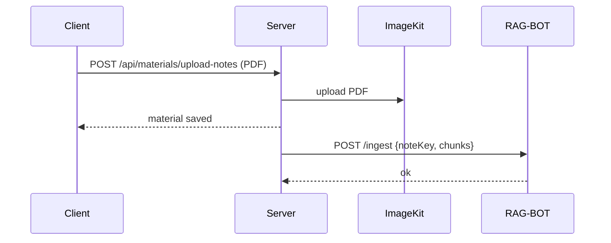
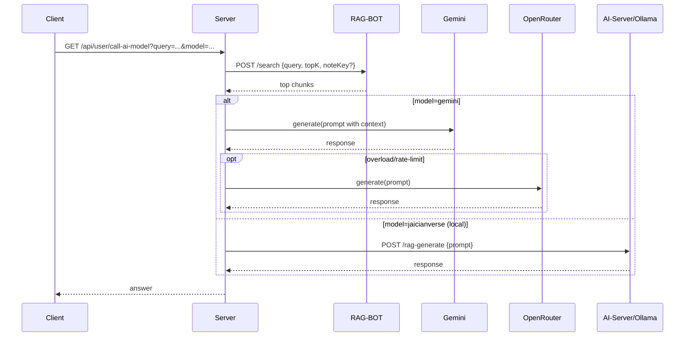

# jAIcianVerse

jAIcianVerse is an AI-assisted academic platform for students and faculty. It combines a unit-wise materials hub, discussions, and an AI tutor that answers using **RAG (Retrieval‑Augmented Generation)** so responses stay grounded in your syllabus content.

At a product level, it’s built around the idea that students learn faster when:
- notes are easy to find (and the best ones rise via upvotes),
- doubts can be discussed publicly (Q&A + announcements),
- and the AI tutor answers from *your* notes/knowledge base instead of generic internet knowledge.

## Who it’s for

- **Students**: browse/upload notes, ask unit-specific doubts, practice with quizzes, join discussions, chat.
- **Professors**: share materials, post announcements, participate in discussions and group chats.

The backend supports user roles (`student` / `professor`) and semester/branch context.

## Key features (what the app actually does)

## Typical user journeys

### Student journey (unit study loop)

1. Sign up / log in.
2. Pick a subject + unit in the Materials area.
3. Download/browse notes from Study Hub (and upvote helpful ones).
4. If notes exist, ask doubts in “Ask AI Tutor” (answers come from the uploaded notes).
5. Use Smart Summary to get a quick unit overview.
6. Take Quick Quiz to self-check understanding.
7. Post a doubt in Discussions; upvote helpful answers.

### Contributor journey (make the unit smarter)

1. Upload a PDF via “Contribute Notes”.
2. The server extracts and chunks the PDF text.
3. RAG-BOT ingests embeddings under your unit’s `noteKey`.
4. From that point on, unit-scoped AI answers can cite relevant chunks from the uploaded notes.

### 1) Materials Hub (unit-wise)

- Upload PDF notes (validated as PDF, size-limited).
- Store and list materials per subject/unit.
- Upvote materials so helpful notes rise to the top.

### 2) AI Study Assistant (RAG-based)

Two modes are implemented:

- **Global assistant** (college/university knowledge base)
  - Used by the floating chat widget.
  - Retrieves context from a global knowledge file (`AI-Server/data/college.data.txt`).

- **Notes mode** (subject + unit)
  - Used inside the Materials experience when you pick a subject/unit.
  - Retrieves context from notes you uploaded for that unit (stored under a per-unit `noteKey`).
  - If no notes exist, it prompts the user to upload notes.

The assistant can run on:
- **Gemini** (default) with overload fallback to **OpenRouter**, or
- a **local Ollama model** via the AI-Server.

### 3) Smart Summary

- Generates a unit summary by sampling text from a few PDFs.
- Caches the generated summary for reuse.

### 4) Quick Quiz

- Generates practice questions (MCQ-style) from the unit summary/context.

### 5) Discussions + Announcements

- Post academic discussions (questions) and answers.
- Upvote answers (answers are sorted by upvotes, then recency).
- Post and fetch announcements.

### 6) Real-time Chat (Socket.IO)

- 1:1 and group chats.
- Messaging features include typing indicators, read receipts, edit/delete flows, and online users.

### 7) Gamification

- Points are incremented for certain actions (used by the UI to encourage contribution).

## What’s in this monorepo

- **Client**: React + TypeScript + Vite
- **Server**: Node.js + Express API (auth, materials, discussions, chat, etc.)
- **AI-Server**: Node.js service that talks to **Ollama** for generation, with optional RAG via the Python service
- **RAG-BOT**: Python (Flask) semantic search service (Sentence-Transformers)
- **Fine-Tune**: Offline LoRA fine-tuning pipeline to build a better local model for Ollama

```mermaid
flowchart LR
  C[Client (Vite/React)] -->|HTTP| S[Server :3000]
  C -->|HTTP| S
  C -->|Socket.IO| S
  S -->|/search, /ingest| R[RAG-BOT :5001]
  S -->|local model| A[AI-Server :5000]
  A -->|/api/chat| O[Ollama :11434]
  R --> D[(Knowledge base + note stores)]
```

## How the AI works (end-to-end)

### A) Notes upload → becomes searchable (RAG ingest)

When a user uploads a PDF note:
1. The Server stores the PDF (ImageKit) and saves metadata to MongoDB.
2. The Server extracts text from the PDF (pdf.js), chunks it, and calls the Python retriever:
   - `POST /ingest` with a `noteKey` like `Subject_Name_3`
3. RAG-BOT stores embeddings under `AI-Server/RAG-BOT/notes_data/<noteKey>.pkl`.



### B) Ask a question → RAG search → model answer

The client calls `GET /api/user/call-ai-model`.

1. Server asks RAG-BOT for relevant chunks (`POST /search`).
2. Server builds a strict prompt that forces the model to answer only from retrieved context.
3. Server generates an answer using either:
   - Gemini → fallback to OpenRouter if Gemini is overloaded, or
   - local AI → the AI-Server → Ollama.



## Backend modules (what each part is responsible for)

### Server (Express + MongoDB)

The Server exposes REST endpoints under `/api/*` and also hosts Socket.IO for real-time chat.

Route groups (high level):
- `/api/user` — auth, profile, points, AI gateway endpoint (`call-ai-model`)
- `/api/materials` — upload notes, list materials, upvotes, summary + MCQ generation
- `/api/discussions` — discussions, answers, answer upvotes, announcements
- `/api/answers` — user stats (answers count)
- `/api/chat` — create/fetch chats (1:1 and group), user search
- `/api/message` — message history and search (REST), plus Socket.IO for real-time

Authentication:
- JWT-based (`Authorization: Bearer <token>`)
- Protected routes use middleware to attach `req.user`.
- Socket.IO connections also verify JWT during handshake.

File storage:
- PDFs are uploaded using `multer` (in-memory) and stored via ImageKit.
- Some generated artifacts (like summaries) are cached via Cloudinary raw upload.

### AI-Server (Node)

Provides LLM generation endpoints backed by Ollama:
- `POST /generate` — LLM only
- `POST /rag-generate` — retrieval first (calls the Python service), then LLM

### RAG-BOT (Python)

Semantic search service using Sentence-Transformers (`all-MiniLM-L6-v2`):
- `GET /health`
- `POST /search` — returns top relevant chunks
- `POST /ingest` — stores per-note embeddings (by `noteKey`)
- `POST /rebuild` — rebuild global embeddings from the knowledge file

## Frontend experience (what users see)

The Client is a React + Vite app that surfaces the backend modules as an “academic workspace”.

Key UI surfaces you’ll notice in the codebase:
- Materials experience that branches into:
  - Study Hub (materials list + upvotes)
  - Ask AI Tutor (unit-scoped notes mode)
  - Smart Summary
  - Quick Quiz
  - Trending/Discussions
  - Visual Vault (video learning)
- A floating AI chat widget with optional voice input.

## Fine-tuning (optional, for a better local model)

The [Fine-Tune/](Fine-Tune/) folder contains an end-to-end LoRA pipeline that produces a GGUF model you can load into Ollama.

Use cases:
- You want **offline/local** answers without calling cloud APIs.
- You want the local model to “internalize” more domain knowledge (reduces reliance on retrieval for some questions).

See [Fine-Tune/README.md](Fine-Tune/README.md) for the full training/export steps.

## Prerequisites

- Node.js (recommended: latest LTS) + npm
- Python 3.10+ (for `AI-Server/RAG-BOT`)
- (Optional) Ollama for local model inference

## Quick start (run everything)

From the repo root:

```bash
npm install
npm run jaicianverse
```

This uses `concurrently` to start:
- Client (Vite)
- Server (Express)
- AI-Server (Express)
- RAG-BOT (Flask)

## Install dependencies (first time)

If you prefer explicit installs per service:

```bash
cd Client
npm install

cd ../Server
npm install

cd ../AI-Server
npm install

cd RAG-BOT
pip install -r requirements.txt
```

Note: `RAG-BOT` lives under `AI-Server/RAG-BOT`.

## Run services manually (recommended order)

Open 4 terminals:

### 1) Client
```bash
cd Client
npm run dev
```

### 2) Server
```bash
cd Server
npm run start
```

### 3) AI-Server
```bash
cd AI-Server
npm run start
```

### 4) RAG-BOT (Python)
```bash
cd AI-Server/RAG-BOT
python app.py
```

## Default URLs / ports

- Client (Vite): typically `http://localhost:5173`
- Server API: `http://localhost:3000`
- AI-Server: `http://localhost:5000` (when `AI-Server/.env` has `PORT=5000`)
- RAG-BOT: `http://localhost:5001`
- Ollama: `http://localhost:11434`

## Environment variables

If these files don’t exist on your machine, create them locally. They usually contain secrets and should not be committed.

### `Server/.env`

Minimum:

```bash
MONGO_URI=mongodb://...
JWT_SECRET=change-me
```

Additional keys used by the codebase (enable features as needed):

```bash
# AI providers (used by /api/user/call-ai-model and summary/quiz generation)
GEMINI_API_KEY=...
OPEN_ROUTER_API_KEY=...
SITE_URL=http://localhost:5173
SITE_NAME=JaicianVerse

# RAG service
RAG_SERVICE_URL=http://localhost:5001

# File storage
IMAGEKIT_PUBLIC_KEY=...
IMAGEKIT_PRIVATE_KEY=...
IMAGEKIT_URL_ENDPOINT=...

# Cloudinary (used to cache generated summaries as text files)
CLOUD_NAME=...
CLOUD_PRESET_NAME=...
```

### `AI-Server/.env`

```bash
PORT=5000
OLLAMA_URL=http://localhost:11434
OLLAMA_MODEL=jaicianverse
RAG_SERVICE_URL=http://localhost:5001
```

### `Client/.env`

The client reads these (see `import.meta.env.*` usage in the code):

```bash
VITE_BACKEND_URL=http://localhost:3000

# Optional (only if you use the related features)
VITE_CLOUD_NAME=...
VITE_CLOUD_PRESET_NAME=...
VITE_GOOGLE_CLOUD_API_KEY=...
```

## What RAG does here

- The AI-Server exposes:
  - `POST /generate` → direct generation (LLM-only)
  - `POST /rag-generate` → retrieves relevant chunks first, then generates using that context
- RAG-BOT indexes `AI-Server/data/college.data.txt` (plus optional per-note stores under `AI-Server/RAG-BOT/notes_data/`).

For deeper details, see `AI-Server/README.md`.

## Repo layout (high level)

- `Client/` — web frontend (React + Vite)
- `Server/` — main backend API (Express + MongoDB)
- `AI-Server/` — LLM + RAG gateway (Ollama + retriever)
- `Fine-Tune/` — datasets + training scripts (experiments)

## Troubleshooting

- **Mongo connection fails**: verify `MONGO_URI` in `Server/.env` and that MongoDB is reachable.
- **AI answers fail**: ensure Ollama is running and `OLLAMA_URL` is correct.
- **RAG endpoints return empty context**: confirm `AI-Server/RAG-BOT` is running and `RAG_SERVICE_URL` points to `http://localhost:5001`.

## Project documentation

- [Report.md](Report.md) — detailed write-up (architecture, API groups, database design)
- [AI-Server/README.md](AI-Server/README.md) — deep dive on RAG (retrieval + generation)
- [Fine-Tune/README.md](Fine-Tune/README.md) — training/export pipeline for the local model
