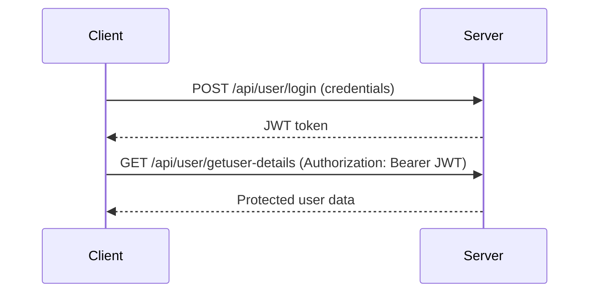
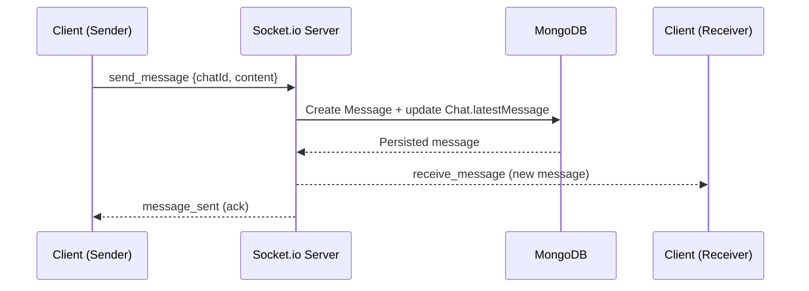
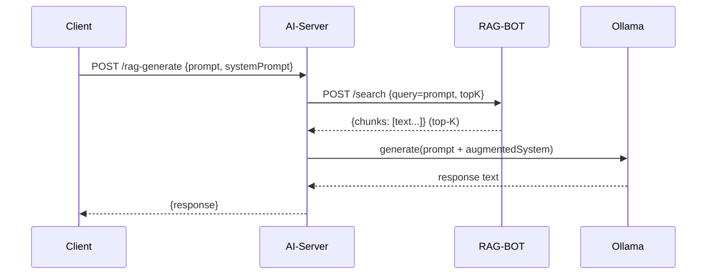

# Project Report

> **Note (Formatting for final print):** As per college guidelines, the final submission should be prepared in *Times New Roman* with the specified font sizes and margins in a word processor (DOC/PDF). This Markdown file is the working draft for content.

---

# Facing Page

**Project Title:** jAIcianVerse – AI-Powered Academic Collaboration and Tutoring Platform  
**Submitted by:** (Your Name) – (USN)  
**Under the guidance of:** (Guide Name / Designation)  
**Department:** (Department Name)  
**Institution:** JSS Science and Technology University, Mysuru  
**Academic Year:** (YYYY–YY)

---

# Inner Title Page

**jAIcianVerse – AI-Powered Academic Collaboration and Tutoring Platform**

Submitted in partial fulfillment of the requirements for the award of the degree of  
**(Degree Name)** in **(Branch/Program)**

Submitted by:  
(Your Name) – (USN)  

Under the guidance of:  
(Guide Name / Designation)

Department of (Department Name)  
JSS Science and Technology University, Mysuru  
(Academic Year)

---

# Certificate – JSS Science and Technology University

> *(Use the exact department-prescribed certificate format. Below is a placeholder.)*

This is to certify that the project titled **“jAIcianVerse – AI-Powered Academic Collaboration and Tutoring Platform”** is a bonafide work carried out by **(Student Name, USN)** under my supervision and guidance during the academic year **(YYYY–YY)** in partial fulfillment of the requirements for the award of the degree of **(Degree/Program)**.

Guide Signature: ____________  
Name: (Guide Name)  
Designation: (Designation)  
Department: (Department)

---

# Certificate – Industry / Organization (if any)

Not Applicable.

---

# Certificate of Plagiarism Check

> Attach the plagiarism report/certificate here in the final document.

Similarity Index: ____ %  
Permitted similarity: **< 20%**  
Tool used: (Tool name)

---

# Acknowledgement

I express my sincere gratitude to **(Guide Name / Designation)** for the continuous guidance, encouragement, and timely feedback provided throughout the development of this project. I also thank the faculty members of the **Department of (Department Name)** for their support and suggestions during reviews.

I am grateful to my friends and peers for constructive discussions and for helping in testing and validating the system features. Finally, I thank my family for their support and motivation.

---

# List of Tables (Roman numbering)

| Table No. | Title |
|---:|---|
| Table I | Literature Review Summary (Table 2.1) |
| Table II | Software Requirements (Table 3.1) |
| Table III | Hardware Requirements (Table 3.2) |
| Table IV | Module-wise Technology Summary (Table 4.1) |
| Table V | Key REST API Route Groups (Table 5.1) |
| Table VI | Socket Events Used for Collaboration (Table 5.2) |
| Table VII | Feature Validation Summary (Table 6.1) |
| Table VIII | Representative AI Scenarios (Table 6.2) |

---

# List of Figures

Fig 1 : Overall system architecture (high level)	____
Fig 2 : RAG generation flow	____
Fig 3 : JWT authentication flow (simplified)	____
Fig 4 : Real-time message delivery flow (simplified)	____
Fig 5 : Fine-tuning and export pipeline	____
Fig 6 : Login page (screenshot)	____
Fig 7 : Signup page (screenshot)	____
Fig 8 : Home/Dashboard (screenshot)	____
Fig 9 : Materials/Notes module (screenshot)	____
Fig 10 : Discussions/Q&A module (screenshot)	____
Fig 11 : Chat module (screenshot)	____
Fig 12 : AI assistant response (RAG example) (screenshot)	____

---

# Abstract

jAIcianVerse is a full-stack academic support platform designed to bring structured learning resources, collaboration, and AI-based assistance into a single workflow. The project addresses a common student challenge: doubts and revision needs often arise outside class hours, and existing solutions are fragmented across multiple tools (materials in one place, discussions elsewhere, and messaging in separate apps). To improve continuity and reduce context switching, the system integrates academic modules (materials/notes, discussions, announcements) with real-time communication (chat) and an AI assistant.

The AI assistant is designed for college use rather than generic chatting. It combines Retrieval-Augmented Generation (RAG), which retrieves relevant context from a curated university knowledge base, with LoRA-based fine-tuning to align the model’s responses with the domain and expected academic tone. The architecture is implemented as a React + TypeScript client, a Node.js/Express backend with MongoDB for persistence, Socket.io for real-time messaging, and a dedicated AI-Server that orchestrates retrieval and inference through a local LLM runtime. In addition, the project includes an end-to-end fine-tuning pipeline that converts notes into instruction-style datasets, trains LoRA adapters, and exports a deployable model artifact.

The outcome is a modular, demonstrable platform that supports structured learning, collaboration, and syllabus-grounded AI assistance, along with a clear path for future enhancements such as improved retrieval, evaluation, and production hardening.

---

# CONTENTS

> Page numbers will be finalized after converting this report to DOC/PDF. The final submission should be adjusted to approximately **65 pages** by adding screenshots (Appendix D), expanding Chapter 5 implementation details, and including required certificates/appendices.

Facing Page	i  
Inner Title Page	ii  
Certificate – JSS Science and Technology University	iii  
Certificate – Industry / Organization	iv  
Certificate of Plagiarism Check	v  
Acknowledgement	vi  
List of Tables	vii  
List of Figures	viii  
Abstract	ix  

Chapter 1: Introduction	1  
1.1 Problem Statement	1  
1.2 Aim	2  
1.3 Objectives	2  
1.4 Scope of the Project	4  
1.5 Organization of the Report	5  

Chapter 2: Literature Review	6  
2.1 Related Works	6  
2.2 Gap Analysis	12  

Chapter 3: System Requirements and Analysis	14  
Chapter 4: Tools and Technologies Used	18  
Chapter 5: System Design and Implementation	24  
Chapter 6: Results and Discussion	50  
Chapter 7: Conclusion and Future Scope	58  
REFERENCES	60  
APPENDICES	62

---

# Chapter 1: Introduction

This chapter introduces the problem addressed by the project, the aim, objectives, and the scope of the work carried out in **jAIcianVerse**.

## 1.1 Problem Statement
In everyday college learning, students regularly face small doubts that slow them down: a concept that feels incomplete, a topic that needs a quick recap, or a question that comes up while reading notes late at night. In practice, students either search the internet (where answers may not follow the syllabus), depend on peers (who may not always be available), or wait until the next class.

At the same time, academic workflows are often fragmented: materials are stored in one place, discussions happen somewhere else, and real-time collaboration is handled through separate messaging apps. This fragmentation reduces continuity and makes it harder to learn collaboratively.

Therefore, the problem addressed by this project is to build a unified academic platform that enables students and faculty to:

1. Manage and access academic content (units, materials, announcements) in an organized way.
2. Ask and answer questions through structured discussions.
3. Communicate in real time for collaboration.
4. Use an AI assistant that produces answers aligned with course material and grounded in college-provided notes.

General-purpose chatbots can produce confident but incorrect answers (hallucinations), and they may not reflect the specific content taught in a course. This motivates an AI assistant that is constrained by a knowledge base (through **Retrieval-Augmented Generation**) and aligned to the academic domain (through **LoRA-based fine-tuning**) while being integrated into a complete full-stack application.

## 1.2 Aim
To design and develop **jAIcianVerse**, a full-stack academic platform that combines content management and collaboration with an AI assistant that is grounded in college materials using **RAG** and aligned using **LoRA-based fine-tuning**.

## 1.3 Objectives

### 1.3.1 Build a unified academic platform
- Implement core academic modules such as units, materials, announcements, discussions, and chat within one application.

### 1.3.2 Implement secure authentication and user management
- Provide secure login and user management using token-based authentication, with suitable access control for different user roles.

### 1.3.3 Enable real-time collaboration
- Support real-time communication using a socket-based mechanism for messaging and collaboration.

### 1.3.4 Implement Retrieval-Augmented Generation (RAG)
- Build a retrieval workflow that searches the knowledge base (college notes) for relevant context.
- Generate answers by combining retrieved context with the user query to reduce off-topic or incorrect responses.

### 1.3.5 Fine-tune the LLM using LoRA and integrate inference
- Prepare a domain dataset suitable for supervised fine-tuning.
- Train LoRA adapters to align the base model with the expected academic response style.
- Export the tuned artifacts and integrate them into the inference pipeline used by the application.

## 1.4 Scope of the Project
The scope of jAIcianVerse covers the end-to-end development of an academic application with an AI assistant:

- **Frontend (Client):** A web-based UI for students/faculty to access units and materials, participate in discussions, chat, and interact with the AI assistant.
- **Backend (Server):** REST APIs for user management, academic modules, chat/discussion features, and required integrations.
- **Real-time communication layer:** Socket-based events to support instant messaging (and related collaboration features).
- **AI subsystem:**
  - RAG-based retrieval from college notes.
  - LLM inference integration for generating responses.
  - A fine-tuning pipeline (LoRA) used to adapt the base model to the project domain.

The project does not focus on enterprise-scale deployment, high-availability infrastructure, or institution-wide governance workflows. Such items can be treated as enhancements beyond the current implementation.

This is an academic project and is not carried out under a specific industry organization; hence a detailed company profile is not applicable.

## 1.5 Organization of the Report
This report is organized to explain the project from motivation to implementation and outcomes:

- **Chapter 1** explains why the project is needed and defines its goals.
- **Chapter 2** reviews related work and clearly states the gap addressed.
- **Chapter 3** documents system requirements and analysis.
- **Chapter 4** lists the tools and technologies used.
- **Chapter 5** presents the architecture, design decisions, and implementation details across modules.
- **Chapter 6** discusses results with outputs/examples and highlights limitations.
- **Chapter 7** concludes the project and outlines future improvements.

---

# Chapter 2: Literature Review

This chapter summarizes the concepts and existing approaches that are closely related to the work implemented in jAIcianVerse. The intention is not to reproduce any single paper or article, but to build a clear foundation: what is commonly done, what works well, and what limitations remain when these ideas are used in an academic environment.

**Table 2.1: Literature Review Summary**

| Sl no | Title | Author | Year | Proposed (paraphrased) |
|---:|---|---|---:|---|
| 1 | *Adaptive Learning Using Artificial Intelligence in e-Learning: A Literature Review.* *Education Sciences, 13*(12), 1216. | Ilie Gligorea; Marius Cioca; Romana Oancea; Andra-Teodora Gorski; Hortensia Gorski; Paul Tudorache | 2024 | Reviews evidence that AI-driven personalization can improve learner engagement and outcomes, while also highlighting practical concerns such as implementation complexity and data/privacy risks. |
| 2 | *How to Build an Adaptive AI Tutor for Any Course Using Knowledge Graph-Enhanced Retrieval-Augmented Generation.* | Dong, C.; Yuan, Y.; Chen, K.; Cheng, S.; Wen, C. | 2023 | Presents a tutoring approach that combines retrieval-augmented generation with knowledge-graph structure; reports measurable improvement over a baseline in controlled evaluation. |
| 3 | *Multimedia Learning* (2nd ed.). Cambridge University Press. | Mayer, R. E. | 2009 | Argues that well-designed combinations of visual and verbal information can improve understanding and retention, especially when learners can control pacing and presentation. |
| 4 | *The impact of artificial intelligence on learner–instructor interaction in online learning.* | Kyoungwon Seo; Joice Tang; Ido Roll; Sidney Fels; Dongwook Yoon | 2021 | Discusses how AI changes learner–instructor interaction: automation can help, but it may also reduce perceived instructor presence and shift classroom norms if used without care. |

## 2.1 Related Works

### 2.1.1 Academic platforms (LMS) and learning workflows
Most colleges rely on some form of learning platform to distribute materials and announcements. In general, these systems are good at organizing content, but they do not always support an “ask-and-learn” workflow. Students still switch between notes, messaging apps, and search engines to clarify doubts. A common observation in academic tools is that features like materials, discussions, and collaboration often exist, but they feel disconnected rather than part of one learning journey.

### 2.1.2 Discussion forums and peer-assisted learning
Course-based discussion boards help students ask questions, receive answers, and learn from others’ doubts. The strength of forums is that responses can be reviewed later and improved over time. The limitation is speed and availability—students may not get an immediate response when they need it most. Also, discussions can become unstructured if not linked tightly with units/materials.

From a learning perspective, this aligns with the idea that students benefit when information is organized and revisitable, rather than delivered only in one-time conversations.

### 2.1.3 Educational chatbots and AI tutoring
AI tutors can reduce the time needed to get explanations and can provide multiple variations of an answer. However, when such systems are not grounded in a syllabus or trusted course content, they may respond with information that is irrelevant, outdated, or simply incorrect. This issue becomes more serious in technical subjects where wrong guidance can mislead learning.

Recent literature on adaptive learning in e-learning also emphasizes that personalization can be beneficial, but it introduces design and data-handling challenges that must be addressed responsibly [1].

### 2.1.4 Retrieval-Augmented Generation (RAG)
RAG is commonly used to make language model answers more dependable by retrieving relevant context from a knowledge base and then generating an answer using that context. Conceptually, it introduces a “check your notes first” step before answering. In education, this is especially useful because the desired answers should align with the course notes rather than general internet content.

In modern NLP, this pattern is widely discussed as a practical approach for knowledge-intensive tasks [4].

At the same time, RAG quality depends heavily on practical choices such as how the content is chunked, how retrieval is done, and how the retrieved text is inserted into prompts. Poor retrieval can still lead to weak answers, even if the generation model is strong.

Some approaches extend RAG using structured representations such as knowledge graphs to improve tutoring behavior and evaluation performance (Dong et al., 2023). While implementation complexity increases, the direction supports the core idea used in this project: retrieval improves the “grounding” of answers.

### 2.1.5 Semantic search using embeddings
Many retrieval systems use embeddings to represent text in a vector space so that semantically similar content can be found even when the user’s wording does not exactly match the stored notes. This approach improves search flexibility compared to keyword search. In academic settings, semantic retrieval helps when students ask questions in informal language while the notes use formal definitions.

For jAIcianVerse, this matters because student queries may be short (“Explain this unit quickly”) or expressed in everyday language, but the knowledge base is written in textbook style. Semantic retrieval helps bridge that mismatch.

### 2.1.6 Fine-tuning and parameter-efficient adaptation (LoRA)
Fine-tuning adapts a base language model to better match a desired domain and response style. Parameter-efficient methods such as LoRA are popular because they reduce training cost by learning a relatively small set of additional parameters rather than updating the full model. For an academic project, this is practical: it enables domain alignment without requiring large compute resources.

However, fine-tuning alone does not guarantee factual correctness, because the model can still produce plausible-sounding responses. This is why jAIcianVerse combines fine-tuning (for behavior/style) with RAG (for grounding in notes).

### 2.1.7 Real-time messaging and collaboration
Real-time chat systems are typically implemented using persistent connections and event-based messaging. In student collaboration, this supports quick coordination, doubt clarification, and group learning. The key engineering challenge is to keep the system consistent (rooms, message delivery, user presence) while maintaining security (authentication/authorization).

In addition to the engineering side, online learning research also highlights that AI tools can reshape learner–instructor interaction patterns (Seo et al., 2021). This reinforces a design principle used in jAIcianVerse: AI assistance should complement collaboration—not replace human guidance.

### 2.1.8 Multimedia learning perspective (why UI and explanations matter)
Even with strong backend and AI systems, learning quality depends on how information is presented. Multimedia learning theory suggests that learners benefit when verbal explanations and visual organization work together, especially when the learner can control the pace [3]. This supports interface decisions such as structured units/materials, readable layouts, and the ability to navigate between content, discussions, and AI explanations.

## 2.2 Gap Analysis
Based on the above related work, the following gaps motivate the design of jAIcianVerse:

### 2.2.1 Lack of syllabus-grounded answers in generic AI tools
Students using general AI assistants may get answers that are not aligned with the college syllabus or the notes provided by faculty. This reduces trust and can confuse learning.

### 2.2.2 Limited integration of academic workflow + AI in one platform
Many systems either focus on academic management (materials, announcements) or on AI chat. When these are separate, the learning flow breaks: students move across tools and lose context.

### 2.2.3 Need for a combined approach: RAG for grounding + LoRA for alignment
RAG improves grounding, while LoRA fine-tuning improves domain style and consistency. In many student-facing solutions, only one of these approaches is used. Combining them provides a more balanced approach for reliability and usability.

### 2.2.4 Real-time collaboration is often treated as an external tool
Chat and collaboration are commonly handled through external apps. Embedding real-time collaboration within the academic platform improves continuity and supports discussion around the exact unit/material being studied.

---

# Chapter 3: System Requirements and Analysis

This chapter describes the requirements considered while building jAIcianVerse. The focus here is practical: what inputs the system expects, what outputs it produces, and what software/hardware environment is needed to run and evaluate the project.

## 3.1 Input Requirements
The system consumes multiple types of inputs depending on the module being used:

- **User inputs:**
  - Registration and login details (credentials and basic profile information).
  - Messages in chat and questions in discussions.
  - Queries asked to the AI assistant.
- **Academic content inputs:**
  - Units, materials, and announcements added by the authorized users.
  - Documents or text content used as reference material (where applicable).
- **AI knowledge inputs:**
  - A curated knowledge base (for RAG) such as college notes/text files.
  - Fine-tuning dataset entries (Q&A pairs) in a structured format (JSONL) for training.

In simple terms: the platform takes *human interaction data* (messages/questions), *academic structure* (units/materials), and *domain knowledge* (notes + dataset) as its primary inputs.

## 3.2 Output Requirements
The outputs are designed to be useful both to learners and to evaluators (guide/examiners):

- **User-facing outputs:**
  - Chat messages and discussion responses.
  - Organized academic materials and units.
  - AI assistant responses that include syllabus-aligned explanations.
- **System outputs:**
  - API responses (JSON) for all client operations.
  - Logs/errors for debugging (during development/testing).
  - Fine-tuning artifacts such as adapter weights and exported model files.

## 3.3 Software Requirements
The project is implemented as a multi-module application (client + server + AI services + training scripts). The following software requirements were considered.

**Table 3.1: Software Requirements**

| Component | Requirement | Purpose |
|---|---|---|
| Operating System | Windows / Linux (development-friendly) | Running the client, servers, and scripts |
| Node.js Runtime | A modern Node.js version (recommended LTS) | Runs Server and AI-Server modules |
| Package Manager | npm | Installs JavaScript/TypeScript dependencies |
| Database | MongoDB (local or cloud) | Stores users, chats, messages, materials, etc. |
| Python | Python 3.x (recommended 3.10+) | Runs RAG-BOT and training utilities |
| Python Packages | Requirements as per `requirements.txt` | Embeddings/search and training dependencies |
| LLM Runtime | Ollama (local inference) | Serves the base/fine-tuned model for generation |
| Browser | Latest Chrome/Edge/Firefox | Runs the React client |

## 3.4 Hardware Requirements
Hardware needs depend on whether the user is only running the application or also running model fine-tuning locally.

**Table 3.2: Hardware Requirements (recommended)**

| Use Case | CPU | RAM | Storage | GPU (Optional) |
|---|---:|---:|---:|---|
| Run Client + Server + DB | 4 cores | 8 GB | 10+ GB free | Not required |
| Run AI inference locally (Ollama) | 6+ cores | 16 GB | 20+ GB free | Helpful but optional |
| Fine-tuning (LoRA) locally | 8+ cores | 16–32 GB | 30+ GB free | Recommended for faster training |

These values are not strict “minimums”; they represent a comfortable setup for development and demonstration. If compute resources are limited, training can be executed on a more capable machine and the exported model can be used later for inference.

## 3.5 Functional Requirements
Functional requirements describe *what the system should do*. For jAIcianVerse, the key functional requirements are:

1. **User Authentication and Profile**
  - Allow users to register and log in securely.
  - Maintain user session using token-based authentication.

2. **Academic Content Management**
  - Create and manage units/modules.
  - Upload or attach learning materials to units.
  - Publish announcements to users.

3. **Discussions and Q&A**
  - Allow users to create discussion threads.
  - Allow authorized users/peers to post answers.
  - Associate discussions with the relevant academic context (unit/topic).

4. **Real-time Messaging**
  - Enable chat between users (one-to-one and group scenarios as supported).
  - Deliver messages in real time and keep chat history persisted.

5. **AI Assistant (RAG + Fine-tuned Model)**
  - Accept user questions and retrieve relevant context from the knowledge base.
  - Generate responses using the LLM with grounded context.
  - Use the fine-tuned model behavior where configured.

6. **Administration and Maintenance (basic)**
  - Provide basic management capability for content and users (as implemented).
  - Provide meaningful error messages for invalid requests.

## 3.6 Non-Functional Requirements
Non-functional requirements describe *how well the system should operate*.

- **Usability:** The UI should be easy to navigate, with clearly separated academic modules and an AI assistant that feels like part of the workflow.
- **Performance:** Common operations (navigation, loading chats, opening discussions) should feel responsive; AI responses should return in a reasonable time for a demo environment.
- **Reliability:** The system should handle failures gracefully (e.g., if the AI retrieval service is temporarily unavailable).
- **Security:** Protected routes should require authentication; sensitive fields (e.g., passwords) should not be exposed in responses.
- **Maintainability:** Module boundaries (Client/Server/AI services) should be clear so that features can be updated independently.
- **Scalability (prototype-level):** The design should be extendable to more users and more content, even if production scaling is not the main goal of this academic version.

---

# Chapter 4: Tools and Technologies Used

This chapter describes the main tools, frameworks, and technologies used to build jAIcianVerse. The selection is based on two priorities: (1) building a working full-stack system with a clean developer experience, and (2) integrating AI capabilities (RAG and fine-tuning) in a way that is feasible for an academic project.

**Table 4.1: Module-wise Technology Summary**

| Module | Technologies | Why it is used |
|---|---|---|
| Client | React, TypeScript, Vite, Tailwind CSS (and supporting UI libs) | Fast UI development, type safety, maintainable component-based design |
| Server | Node.js, Express.js, MongoDB, Mongoose, JWT, Socket.io | REST APIs, persistence, authentication, and real-time messaging |
| AI-Server | Node.js, Express.js, Ollama integration | API layer for generation + orchestration between retrieval and model inference |
| RAG-BOT | Python, embedding-based semantic retrieval | Retrieves relevant context from notes for grounded answers |
| Fine-Tune | Python, Unsloth/Transformers, LoRA | Efficient fine-tuning of an LLM to align with domain behavior |

## 4.1 JavaScript
JavaScript is used as the runtime language for the backend services and for the browser-based frontend. Its ecosystem provides mature libraries for building APIs, handling real-time events, and integrating with external services.

In this project, JavaScript is primarily used in:

- The backend API server (Express.js).
- The AI-Server orchestration layer (calling the LLM runtime and routing AI requests).

## 4.2 TypeScript
TypeScript adds static typing on top of JavaScript. In a project with multiple data models (users, chats, messages, materials, etc.), type safety reduces accidental mistakes—especially when data flows from backend APIs to UI components.

In jAIcianVerse, TypeScript is most valuable in the client where:

- API responses can be represented as types/interfaces.
- UI components become easier to refactor safely.
- Developer productivity improves through better auto-completion and compile-time checks.

## 4.3 React
React is used to build the client application as a component-based single-page application. React’s strengths for this project include:

- Building reusable UI components (chat UI, discussion UI, forms, layout sections).
- Managing view state efficiently across pages.
- Integrating real-time updates (e.g., new messages) with predictable rendering.

## 4.4 Vite
Vite is used as the frontend build tool and dev server. Compared to older bundlers, Vite provides fast startup and quick hot reload, which helps significantly during UI-heavy development. This matters in academic timelines where iterative development and debugging happen frequently.

## 4.5 Tailwind CSS (and UI utilities)
Tailwind CSS supports rapid styling through utility classes. For this project, it helps keep UI styling consistent without writing large amounts of custom CSS. It also makes it easier to maintain a clean UI when the application includes multiple screens such as materials, discussions, chat, and AI assistant.

Where needed, lightweight UI utilities/libraries are used to accelerate common UI patterns (icons, dialogs, animations) without building everything from scratch.

## 4.6 Node.js
Node.js is the runtime environment for the Server and AI-Server modules. It is well-suited for I/O-heavy applications such as APIs, database operations, and real-time event handling. Node.js also enables sharing ecosystem tooling across modules (linting, package management, scripts).

## 4.7 Express.js
Express.js is used to build REST APIs for the application. It provides a flexible routing and middleware model, which is useful for:

- Authentication middleware and protected routes.
- Modular route organization (users, chat, discussions, materials, etc.).
- Standard request/response handling and error handling.

## 4.8 MongoDB
MongoDB is used as the primary database. The project naturally fits a document database because the application stores structured but flexible data such as chat messages, discussion threads, and materials metadata. MongoDB also supports iterative schema evolution, which is practical during academic development.

## 4.9 Mongoose
Mongoose is used as an ODM (Object Data Modeling) layer for MongoDB. It helps define schemas and validation rules, making database operations more structured and consistent. It also improves readability by keeping model definitions in one place.

## 4.10 Socket.io
Socket.io is used for real-time messaging. It enables bi-directional communication between client and server for features such as:

- Instant message delivery.
- Joining/leaving chat rooms.
- Presence and live updates (as supported by the implementation).

Socket-based communication is essential to make chat feel “live”, rather than a page refresh experience.

## 4.11 JWT (JSON Web Tokens)
JWT is used for authentication. Tokens provide a practical way to secure APIs without storing server-side session state for every request. This fits the architecture where the React client calls REST endpoints and also connects to sockets that require authentication.

## 4.12 Ollama (LLM inference runtime)
Ollama is used as a local inference runtime to run the LLM for text generation. This makes the AI features demonstrable even without relying on paid external APIs. It also allows experimentation with different models and fine-tuned variants in a controlled environment.

## 4.13 Retrieval-Augmented Generation (RAG)
RAG is used to ground the AI assistant’s responses in college notes. Instead of expecting the model to “know everything,” the system first retrieves relevant context from a curated knowledge base and then uses that context to generate an answer.

In practice, RAG improves:

- Syllabus alignment (answers reflect provided notes).
- Trust and traceability (responses are influenced by known content).
- Robustness (less reliance on pure model memory).

## 4.14 Python (RAG-BOT and Fine-Tuning)
Python is used for two reasons:

1. Building the semantic retrieval service (RAG-BOT).
2. Running training scripts for LoRA-based fine-tuning.

Python is widely used in AI/ML workflows and provides mature libraries for embeddings, training utilities, and evaluation.

## 4.15 LoRA Fine-Tuning (Unsloth / Transformers)
The project uses LoRA-based fine-tuning to adapt an LLM to the expected academic domain behavior. LoRA is chosen because it is more feasible for an academic setting: it focuses on learning small adapter parameters rather than re-training the entire model.

Unsloth/Transformers-based tooling is used to make the training process practical, reproducible, and easier to experiment with using limited compute.

Implementation and integration details for core tools and frameworks were cross-checked with official documentation where appropriate [5–13].

---

# Chapter 5: System Design and Implementation

This chapter explains how jAIcianVerse is designed and how the major features are implemented. The goal is to show the system as a whole (modules and flows) and then describe each subsystem in a way that is easy to follow during evaluation.

## 5.1 Architecture of jAIcianVerse
jAIcianVerse is implemented as a multi-module system:

- **Client**: a React + TypeScript web application.
- **Server**: a Node.js/Express REST API server connected to MongoDB.
- **Real-time layer**: Socket.io running on the same HTTP server.
- **AI-Server**: a separate Node.js service that calls the LLM runtime.
- **RAG-BOT**: a Python service that performs semantic retrieval over a knowledge base.
- **Fine-Tune**: offline training scripts to create LoRA adapters and export a deployable model.

The reason for splitting AI-Server and RAG-BOT from the main Server is to keep responsibilities clear:

- The Server remains focused on application data, authentication, and core academic workflows.
- AI components can evolve independently (new retrieval strategy, new model, different runtime) without breaking core APIs.

**Fig 1 : Overall system architecture (high level)**

```mermaid
flowchart LR
  U[User (Browser)] -->|HTTP| C[Client (React + TS)]
  C -->|REST API| S[Server (Express, Port 3000)]
  C <-->|Socket.io events| RT[Socket.io (on Server)]
  S -->|MongoDB queries| DB[(MongoDB)]

  C -->|AI request (HTTP)| AIS[AI-Server (Express)]
  AIS -->|/search query| RAG[RAG-BOT (Python)]
  RAG -->|Top-K context chunks| AIS
  AIS -->|Prompt + Context| LLM[Ollama LLM Runtime]
  LLM -->|Generated response| AIS
  AIS -->|AI response| C
```

In addition to the above online runtime, the Fine-Tune module supports offline training and export of a fine-tuned model that can be loaded by the LLM runtime.

## 5.2 Backend API Design (Server)
The backend is built using Express and exposes REST endpoints under a common `/api` prefix. Authentication is primarily handled using JWT tokens, and protected routes use middleware to enforce access control.

At a high level, the backend supports these functional areas:

- **Users and authentication** (signup, login, profile).
- **Academic discussions and announcements**.
- **Materials / notes upload and retrieval**.
- **Chat and messages** (REST + real-time).

To keep this chapter readable, the table below lists the main route groups as implemented.

**Table 5.1: Key REST API route groups (as implemented)**

| Module | Base Path | Example endpoints (not exhaustive) |
|---|---|---|
| Users | `/api/user` | `POST /signup`, `POST /login`, `GET /getuser-details`, `PUT /update-profile` |
| Discussions | `/api/discussions` | `POST /upload-discussion`, `GET /fetch-discussion`, `POST /answers`, `POST /announcements` |
| Materials | `/api/materials` | `POST /upload-notes`, `GET /getMaterials`, `PUT /upvote/:materialId` |
| Answers | `/api/answers` | `GET /getUserAnswers` |
| Chat | `/api/chat` | `POST /` (access chat), `GET /` (fetch chats), `POST /group`, `GET /search-users` |
| Messages | `/api/message` | `POST /`, `GET /:chatId`, `GET /:chatId/search` |

**Note:** The `/api/units` route group exists in the server bootstrap, but route definitions may be extended further depending on the final unit/module feature set.

### 5.2.1 Authentication Flow (JWT)
The authentication design follows a practical stateless approach:

1. The user logs in through `/api/user/login`.
2. The server issues a JWT that represents the user identity.
3. The client includes the token in subsequent requests.
4. Protected endpoints verify the token using middleware.

This same token is also reused for real-time socket authentication so that chat events are not anonymous.

**Fig 3 : JWT authentication flow (simplified)**



### 5.2.2 Request/Response Conventions
The backend follows JSON-based request and response bodies. A consistent pattern is used:

- Validate required fields (e.g., prompt for AI generation, IDs for chat operations).
- Return JSON responses for success and error cases.
- For protected endpoints, reject unauthorized requests early via middleware.

## 5.3 Database Design (MongoDB)
The database is designed around the actual workflows in the application:

- Users must be stored securely.
- Chats must include participant lists and latest-message metadata.
- Messages must preserve content, sender, and message status.
- Discussions and answers must be persisted and retrievable.
- Materials must support uploads and user-level interactions (e.g., upvotes).

At an implementation level, the project uses Mongoose models (schemas) to define these collections and enforce basic validations.

### 5.3.1 Core entities (conceptual)
While the exact schema fields may evolve, the core conceptual entities include:

- **User**: identity, profile information, and auth-related fields.
- **Chat**: a conversation (one-to-one or group) with participant list.
- **Message**: individual chat message records linked to a chat.
- **Discussion**: question threads for academic topics.
- **Answer**: responses linked to discussions and upvote behavior.
- **Material / Notes**: uploaded notes and metadata.
- **Announcements**: broadcast messages.

In the rest of this report, these entities are referenced as the foundation for modules such as chat, discussions, and AI grounding.

## 5.4 Real-Time Messaging (Socket.io)
For chat, the system uses a hybrid approach:

- REST APIs are used for fetching chat lists and history.
- Socket.io is used for low-latency events (send message, typing, read receipts, etc.).

### 5.4.1 Socket authentication
Socket connections are authenticated using the same JWT token used for REST calls. During handshake, the server verifies the token and attaches the user object to the socket session. This avoids anonymous event publishing and ensures that chat operations are attributed to the correct user.

### 5.4.2 Key socket events
The following events represent the real-time feature surface.

**Table 5.2: Socket events used for collaboration**

| Event | Direction | Purpose |
|---|---|---|
| `setup` | Client → Server | Join all chat rooms the user belongs to |
| `join_chat` | Client → Server | Join a specific chat room |
| `send_message` | Client → Server | Send a message to a chat |
| `receive_message` | Server → Client | Deliver a new message to recipients |
| `typing` / `stop_typing` | Client ↔ Server | Typing indicator |
| `read_message` / `messages_read` | Client ↔ Server | Read receipts |
| `edit_message` / `message_edited` | Client ↔ Server | Edit message flow |
| `delete_message` / `message_deleted` | Client ↔ Server | Soft-delete message flow |
| `create_group` / `group_created` | Client ↔ Server | Group chat creation |
| `join_group` / `group_updated` | Client ↔ Server | Add members / update group |
| `leave_group` / `left_group` | Client ↔ Server | Leave group |
| `online_users` | Server → Client | Broadcast list of currently online users |

This event design keeps chat responsive while still persisting the final state (messages, latest message pointer) in MongoDB.

**Fig 4 : Real-time message delivery flow (simplified)**



## 5.5 AI Subsystem Design (AI-Server + RAG-BOT)
The AI features are implemented through a dedicated AI-Server that provides two endpoints:

- `/generate`: Direct generation using the LLM runtime.
- `/rag-generate`: Retrieval-augmented generation (preferred for syllabus grounding).

### 5.5.1 RAG flow used in this project
The RAG pipeline is designed as a simple, reliable chain:

1. The user submits a question.
2. The AI-Server requests semantically relevant text chunks from the retrieval service.
3. The AI-Server augments the system prompt with the retrieved context.
4. The LLM runtime generates the final response.

**Fig 2 : RAG generation flow**



### 5.5.2 Reliability and fallbacks
The retrieval call is treated as a best-effort dependency. If the retrieval service is slow or unavailable, the AI-Server can fall back to generating without additional context. This ensures the user still receives a response, while also making it clear that the best quality is achieved when retrieval is available.

### 5.5.3 Prompt grounding strategy
Instead of pasting retrieved text into the user prompt directly, the system appends relevant context to the *system prompt* section. This encourages the model to prioritize the retrieved content when it is applicable, while still answering naturally.

### 5.5.4 Mathematical formulation (retrieval + generation)
Even though the implementation details may vary by embedding model, the retrieval step can be described using a standard similarity formulation.

Let $\mathbf{q} \in \mathbb{R}^d$ be the embedding of the user query and $\mathbf{c}_i \in \mathbb{R}^d$ be the embedding of the $i$-th context chunk. A commonly used similarity score is **cosine similarity**:

$$
\operatorname{sim}(\mathbf{q}, \mathbf{c}_i) = \frac{\mathbf{q} \cdot \mathbf{c}_i}{\lVert \mathbf{q} \rVert\,\lVert \mathbf{c}_i \rVert}
$$

The system retrieves the top-$k$ chunks with the highest similarity:

$$
\{\mathbf{c}_{(1)},\dots,\mathbf{c}_{(k)}\} = \operatorname{TopK}_{i}\; \operatorname{sim}(\mathbf{q}, \mathbf{c}_i)
$$

During generation, the language model produces the next token distribution using a softmax over logits $\mathbf{z}_t$:

$$
p(y_t\mid y_{<t}, x) = \operatorname{softmax}(\mathbf{z}_t)
$$

Here, $x$ denotes the combined prompt (system prompt + retrieved context + user question), and $y_t$ is the token generated at time step $t$.

## 5.6 Fine-Tuning Pipeline (LoRA)
To improve domain behavior beyond retrieval, the project includes a full LoRA fine-tuning pipeline that:

1. Converts a knowledge file into instruction-style Q&A pairs.
2. Fine-tunes a base LLM using LoRA adapters.
3. Exports the resulting model into a runtime-friendly format.

The pipeline described in the Fine-Tune module can be summarized as:

`TXT → dataset.jsonl → LoRA adapter training → GGUF export → Ollama model`

**Fig 5 : Fine-tuning and export pipeline**

```mermaid
flowchart LR
  A[College Notes / Knowledge TXT] --> B[Chunking + Q&A Generation]
  B --> C[dataset.jsonl\n(instruction-output pairs)]
  C --> D[LoRA Fine-Tuning\n(adapters only)]
  D --> E[Merge + Export to GGUF]
  E --> F[Ollama Model\n(local inference)]
```

### 5.6.1 Dataset preparation
The dataset is stored in JSONL format where each record contains an instruction (question) and expected output (answer). This makes the training data easy to inspect, extend, and version.

### 5.6.2 Training process
LoRA training is used to keep fine-tuning feasible in an academic environment. Instead of updating all parameters of the base model, only small adapter weights are learned. This reduces compute cost and makes experiments faster.

### 5.6.3 Key formulas used in fine-tuning (LoRA + objective)
**(a) LoRA weight adaptation**

For a weight matrix $W \in \mathbb{R}^{m \times n}$ in the base model, LoRA represents the update as a low-rank matrix:

$$
W' = W + \Delta W, \quad \Delta W = BA
$$

where $A \in \mathbb{R}^{r \times n}$ and $B \in \mathbb{R}^{m \times r}$ with rank $r \ll \min(m,n)$. This makes training efficient because the number of trainable parameters becomes approximately:

$$
\#\text{params(LoRA)} \approx r(m+n)
$$

**(b) Training objective (cross-entropy / negative log-likelihood)**

For a target response token sequence $y_1,\dots,y_T$, the standard supervised fine-tuning objective minimizes the negative log-likelihood:

$$
\mathcal{L}(\theta) = -\sum_{t=1}^{T} \log p_{\theta}(y_t \mid y_{<t}, x)
$$

where $x$ is the input prompt (instruction + optional context) and $\theta$ denotes the trainable parameters (in LoRA fine-tuning, primarily the adapter parameters).

This formulation follows the standard LoRA adaptation idea [14].

### 5.6.4 Export and inference integration
After training, the adapter is merged and exported to GGUF so it can be loaded by the local inference runtime. This provides a practical path from “training on a laptop/workstation” to “running the tuned model inside the application stack.”

## 5.7 Frontend Design and Implementation (Client)
The frontend is a React + TypeScript single-page application. The design intent is to keep the learning flow simple:

- Discover content (units/materials).
- Ask questions (discussions).
- Collaborate (chat).
- Use AI support as part of the same experience.

### 5.7.1 Client–Server integration
The client interacts with:

- The main Server via REST for persistent application data.
- The socket layer for real-time chat events.
- The AI-Server for AI responses (direct or RAG).

This separation keeps the UI responsive while ensuring that important state (messages, discussions, materials) is persisted in MongoDB.

---

# Chapter 6: Results and Discussion

This chapter summarizes the outcomes of implementing jAIcianVerse and discusses what worked well, what required trade-offs, and what limitations were observed. Since this is an academic project, the evaluation is presented in a practical manner using feature validation, qualitative observations, and representative usage scenarios.

## 6.1 Functional Results (Module-wise)

### 6.1.1 User Authentication and Profile
The authentication module provides the basic workflow expected in a modern web application: signup, login, and access to protected resources. Protected routes enforce token checks so that private data (such as user-specific notes or chat history) is not accessible without valid authentication.

**Observed outcome:** Authentication enables a clean separation between public data (e.g., certain fetch endpoints) and protected data (profile updates, user-specific data). This is important because many modules—chat, materials, and AI usage—depend on a valid user identity.

### 6.1.2 Academic Discussions and Announcements
The discussion module supports posting questions (threads), viewing existing discussions, and adding answers. Announcements provide a lightweight way to broadcast important messages.

**Observed outcome:** Discussion threads create a structured “doubt-solving” space that is more reviewable than chat. This structure also makes it easier to relate doubts to academic topics.

### 6.1.3 Materials / Notes and Learning Content
The materials module supports uploading notes and retrieving materials. Interactive actions such as upvoting allow users to highlight helpful materials.

**Observed outcome:** Materials act as the “study base” of the platform. When paired with AI grounding (RAG), the same content can also support question answering.

### 6.1.4 Chat and Messages (Real-time)
Chat functionality is implemented using both REST and Socket.io:

- REST endpoints help fetch chat lists and message history.
- Socket events support low-latency interaction (send, receive, typing indicators, read receipts, edit/delete behaviors).

**Observed outcome:** The chat module provides an interactive collaboration experience that feels close to modern messaging apps. The presence of read receipts and typing events also improves usability during discussions.

### 6.1.5 AI Assistant (RAG + Fine-tuned inference)
The AI subsystem provides:

- Direct generation (`/generate`) when context grounding is not needed.
- Retrieval-augmented generation (`/rag-generate`) when the goal is to answer based on the university/college knowledge base.

**Observed outcome:** RAG mode is the more appropriate default for academic usage because it encourages syllabus-aligned answers. The fine-tuning pipeline supports additional alignment by shaping response style and the model’s familiarity with domain phrasing.

## 6.2 Feature Validation (High-level Test Cases)
To present results clearly, the table below summarizes representative test cases and expected outcomes.

**Table 6.1: Feature validation summary**

| Sl no | Feature | Sample action / input | Expected outcome |
|---:|---|---|---|
| 1 | Signup/Login | Register → login with correct credentials | User receives auth token and can access protected endpoints |
| 2 | Protected route access | Call a protected endpoint without token | Request is rejected; protected data is not returned |
| 3 | Post a discussion | Create a discussion thread with title/content | Thread appears in discussion list and is retrievable |
| 4 | Post an answer | Add an answer to a discussion | Answer is stored and visible under the thread |
| 5 | Upload notes/material | Upload a file as notes | Material is stored and visible in materials listing |
| 6 | Upvote (materials/answers) | Toggle upvote on a material/answer | Upvote state toggles and persists |
| 7 | Real-time message delivery | Send a chat message via socket | Recipient receives `receive_message` event; message persists |
| 8 | Typing indicator | Emit `typing` / `stop_typing` | Other users see typing feedback in that chat |
| 9 | Read receipts | Mark message IDs as read | `messages_read` emitted; read status updated |
| 10 | RAG response | Ask a question related to college notes | Response is generated with retrieved context when available |

This validation approach is intentionally practical: it reflects the end-user workflow rather than focusing only on isolated unit tests.

## 6.3 AI Results and Discussion

### 6.3.1 Why RAG is valuable in this project
For college-level use, an AI assistant is useful only if students can trust that it follows the syllabus and the notes that the class expects them to learn. RAG helps by retrieving relevant segments from the knowledge base and encouraging the model to answer using that retrieved context.

In the AI-Server implementation, if retrieval returns relevant chunks, they are appended to the system prompt as “Relevant university knowledge base context.” This provides a clear and controlled grounding signal.

In evaluation terms, retrieval quality is often discussed using simple top-$k$ measures. For example, if a query has $R$ truly relevant chunks in the knowledge base and $r_k$ of them appear in the retrieved top-$k$ results, then a basic recall-at-$k$ definition is:

$$
\operatorname{Recall@k} = \frac{r_k}{R}
$$

This project primarily uses qualitative checks and scenario-based validation, but the above metric provides a clean way to formalize retrieval quality if a labeled set is prepared later.

### 6.3.2 Representative AI usage scenarios
The following scenarios reflect how the AI assistant is intended to be used in the system.

**Table 6.2: Representative AI scenarios (qualitative)**

| Scenario | Example user query | What a good answer should look like |
|---|---|---|
| Concept explanation | “Explain \<topic\> in simple terms.” | Clear explanation, aligned with class notes, includes key definitions |
| Quick revision | “Give a short summary of Unit \<x\>.” | 5–10 bullet revision points; avoids unrelated material |
| Step-by-step help | “How do I solve \<type of problem\>?” | A structured approach, not just a final result |
| Syllabus alignment | “Is \<concept\> part of our syllabus?” | Answer based on stored notes/material references when available |

This report does not claim that the model is “always correct.” Instead, it highlights the design that *reduces* incorrect answers by grounding and by domain alignment.

### 6.3.3 Fine-tuning results (artifacts and integration outcome)
The Fine-Tune module in this repository provides an end-to-end pipeline for LoRA training and export. Based on the repository artifacts:

- A dataset is prepared in JSONL format for instruction-style training.
- LoRA adapters are trained instead of full model weights (parameter-efficient fine-tuning).
- The trained adapter is exported to a runtime-friendly format (GGUF) suitable for local inference runtimes.

**Observed outcome:** Fine-tuning provides a practical way to align response style and domain familiarity. When combined with RAG, it supports both “behavior alignment” (how the assistant responds) and “content grounding” (what the assistant uses to answer).

## 6.4 Performance and Usability Discussion (qualitative)

- **Responsiveness:** The client-server interactions for typical operations (navigation, fetching chats, opening discussions) follow a standard REST pattern and are designed to be responsive in a local demonstration setup.
- **Real-time feel:** Socket events (typing, message delivery, read receipts) significantly improve the perceived usability of chat.
- **AI latency:** AI response time depends on the model runtime and hardware. The architecture supports local inference for demonstrability, but performance can vary across machines.

## 6.5 Limitations
The following limitations are acknowledged as part of an academic-scale implementation:

1. **Dependence on knowledge base quality:** RAG can only retrieve what exists in the notes/data. If the notes are incomplete, answers may be incomplete.
2. **No guaranteed correctness:** Even with grounding and fine-tuning, LLMs can still produce imperfect answers.
3. **Compute requirements:** Fine-tuning and local inference are resource-dependent; low-end machines may require adjusted settings.
4. **Evaluation scope:** This report focuses on functional validation and qualitative outcomes rather than large-scale controlled user studies.

---

# Chapter 7: Conclusion and Future Scope

## 7.1 Conclusion
jAIcianVerse demonstrates a practical integration of full-stack web development and AI assistance for an academic environment. The platform brings together:

- Structured academic content modules (materials and discussions).
- Real-time collaboration (chat powered by socket events).
- An AI assistant designed to be more syllabus-aligned using **RAG** and supported by **LoRA-based fine-tuning**.

The key contribution of this project is not only building an AI chatbot, but embedding it inside an academic workflow where students can learn, discuss, and collaborate without switching tools constantly.

## 7.2 Future Scope
The project can be extended in several meaningful directions:

1. **Better grounding and citation UX:** Show which retrieved chunks influenced an answer (lightweight “sources” view).
2. **Improved retrieval quality:** Experiment with chunking strategies, metadata filtering (unit-wise retrieval), and hybrid search.
3. **More structured evaluation:** Add standardized question sets and rubrics to measure answer quality more systematically.
4. **Role-based academic workflows:** Extend permissions (faculty-only posting, moderation tools, content approval flows).
5. **Deployment hardening:** Add production-grade configuration, monitoring, and scalability improvements.
6. **Content ingestion pipeline:** Automatically parse PDF/DOCX materials into searchable chunks for RAG.

---

# REFERENCES (APA)

> **Note:** References are listed in the order they first appear in this report. Where a venue/URL is not included in the provided reference details, a placeholder is kept so it can be completed before final submission.

Gligorea, I., Cioca, M., Oancea, R., Gorski, A.-T., Gorski, H., & Tudorache, P. (2024). Adaptive learning using artificial intelligence in e-learning: A literature review. *Education Sciences, 13*(12), 1216.

Lewis, P., Perez, E., Piktus, A., Petroni, F., Karpukhin, V., Goyal, N., Küttler, H., Lewis, M., Yih, W.-T., Rocktäschel, T., Riedel, S., & Kiela, D. (2020). Retrieval-augmented generation for knowledge-intensive NLP tasks. *Advances in Neural Information Processing Systems (NeurIPS).* (Add URL/DOI before final submission.)

Dong, C., Yuan, Y., Chen, K., Cheng, S., & Wen, C. (2023). *How to build an adaptive AI tutor for any course using knowledge graph-enhanced retrieval-augmented generation* [Manuscript]. (Add source/URL before final submission.)

Seo, K., Tang, J., Roll, I., Fels, S., & Yoon, D. (2021). The impact of artificial intelligence on learner–instructor interaction in online learning. (Add journal/conference details or URL before final submission.)

Mayer, R. E. (2009). *Multimedia learning* (2nd ed.). Cambridge University Press.

MongoDB, Inc. (n.d.). *MongoDB documentation*. Retrieved April 29, 2026, from https://www.mongodb.com/docs/

Node.js contributors. (n.d.). *Node.js documentation*. Retrieved April 29, 2026, from https://nodejs.org/en/docs

Express.js contributors. (n.d.). *Express documentation*. Retrieved April 29, 2026, from https://expressjs.com/

Socket.IO contributors. (n.d.). *Socket.IO documentation*. Retrieved April 29, 2026, from https://socket.io/docs/

React contributors. (n.d.). *React documentation*. Retrieved April 29, 2026, from https://react.dev/

Vite contributors. (n.d.). *Vite documentation*. Retrieved April 29, 2026, from https://vitejs.dev/guide/

Tailwind Labs. (n.d.). *Tailwind CSS documentation*. Retrieved April 29, 2026, from https://tailwindcss.com/docs

Ollama contributors. (n.d.). *Ollama documentation*. Retrieved April 29, 2026, from https://ollama.com/

Unsloth contributors. (n.d.). *Unsloth documentation / repository*. Retrieved April 29, 2026, from https://github.com/unslothai/unsloth

Hu, E. J., Shen, Y., Wallis, P., Allen-Zhu, Z., Li, Y., Wang, S., Wang, L., & Chen, W. (2021). LoRA: Low-rank adaptation of large language models. *arXiv*. (Add arXiv URL before final submission.)

---

# APPENDICES

## APPENDIX A – Project Team Details

| Sl no | Name | USN | Role / Contribution |
|---:|---|---|---|
| 1 | (Add name) | (Add USN) | (e.g., Backend, AI, Frontend) |
| 2 | (Add name) | (Add USN) | (Add contribution) |
| 3 | (Add name) | (Add USN) | (Add contribution) |

## APPENDIX B – COs, POs and PSOs Mapping (if applicable)

> Replace the placeholders below with your department’s CO/PO/PSO mapping format.

| Course Outcome (CO) | Description | Related POs | Related PSOs |
|---|---|---|---|
| CO1 | (Add) | (Add) | (Add) |
| CO2 | (Add) | (Add) | (Add) |
| CO3 | (Add) | (Add) | (Add) |

## APPENDIX C – Plagiarism Check Certificate

> Attach the plagiarism report/certificate here in the final document (Similarity Index < 20%).

## APPENDIX D – Screenshots / Output Evidence (recommended)

> Add key screenshots in the final report by pasting them under the figure titles below in the final DOC/PDF.

**Fig 6 : Login page (screenshot)**

(Paste screenshot here in final document.)

**Fig 7 : Signup page (screenshot)**

(Paste screenshot here in final document.)

**Fig 8 : Home/Dashboard (screenshot)**

(Paste screenshot here in final document.)

**Fig 9 : Materials/Notes module (screenshot)**

(Paste screenshot here in final document.)

**Fig 10 : Discussions/Q&A module (screenshot)**

(Paste screenshot here in final document.)

**Fig 11 : Chat module (screenshot)**

(Paste screenshot here in final document.)

**Fig 12 : AI assistant response (RAG example) (screenshot)**

(Paste screenshot here in final document.)
